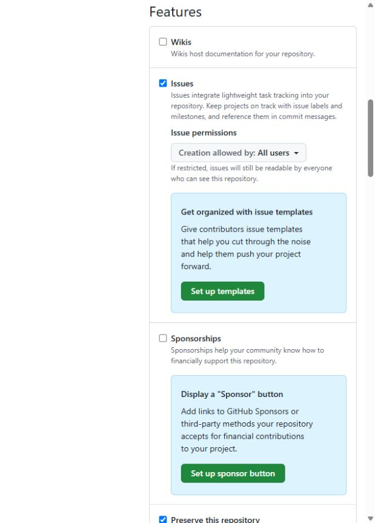

# PoC quản lý GitHub repository bằng Terraform

**Organization:** [xbrain-org-poc](https://github.com/xbrain-org-poc) · **Ngày kiểm chứng:** 30/09/2026 · **Gói:** GitHub Free

Repo [iac-repository-management-poc](https://github.com/xbrain-org-poc/iac-repository-management-poc) chứa mã Terraform và evidence. Terraform tạo và quản lý repo public [repository-demo](https://github.com/xbrain-org-poc/repository-demo). Organization được tạo thủ công; ruleset được áp dụng ở cấp repository.

## Kết quả PoC

| Cần chứng minh | Đã kiểm chứng | Bằng chứng |
| --- | --- | --- |
| Tạo repo và ruleset bằng IaC | Terraform apply thành công `2 added`; repo demo xuất hiện trong org | [Plan](docs/evidence/demo/02-create-plan.txt) · [Apply](docs/evidence/demo/03-create-apply.txt) |
| Quản lý cấu hình repo | Public; Issues bật; Wiki/Projects tắt; chỉ squash merge | [GitHub API](docs/evidence/demo/15-final-settings.json) · [Ảnh merge settings](docs/evidence/demo/19-merge-settings.jpg) |
| Cập nhật bằng IaC | Đổi mô tả repo, apply `1 changed` | [Plan](docs/evidence/demo/07-update-plan.txt) · [Apply](docs/evidence/demo/08-update-apply.txt) · [Ảnh](docs/evidence/demo/09-updated-description.jpg) |
| Phát hiện và khôi phục drift | Tắt Issues ngoài Terraform; plan thấy `false -> true`; apply bật lại; plan cuối `No changes` | [Drift plan](docs/evidence/demo/11-drift-plan.txt) · [Apply](docs/evidence/demo/13-drift-apply.txt) · [Plan cuối](docs/evidence/demo/27-post-merge-plan.txt) |
| Ruleset bảo vệ `main` | Active, yêu cầu PR và 1 approval, chỉ squash, không có bypass | [Rule từ GitHub API](docs/evidence/demo/05-main-rules.json) · [Ảnh cấu hình](docs/evidence/demo/22-ruleset-review.jpg) |
| Kiểm tra hành vi rule | Ghi trực tiếp `main` bị từ chối HTTP 409; [PR demo #1](https://github.com/xbrain-org-poc/repository-demo/pull/1) bị chặn trước review, sau đó `hofang42` approve và merge; nhánh demo được xóa | [Lỗi direct push](docs/evidence/demo/17-direct-main-rejected.txt) · [PR trước review](docs/evidence/demo/16-pr-review-status.json) · [PR đã merge](docs/evidence/demo/23-pr-merged.json) |

## Ảnh bằng chứng chính

**Repo demo được Terraform tạo trong org:** [log apply](docs/evidence/demo/03-create-apply.txt) xác nhận thao tác tạo.

**Drift và khôi phục:** Issues bị tắt ngoài IaC, sau apply đã bật lại.

**Ruleset active trên nhánh mặc định:** yêu cầu PR và một approval; không có bypass.

**PR trước và sau approval:** GitHub chặn merge khi thiếu review; sau approval PR được merge và nhánh demo được xóa.

## Mã nguồn và phạm vi

- [`main.tf`](main.tf): cấu hình repo chứa IaC và ruleset của repo này.
- [`demo.tf`](demo.tf): repo demo và ruleset được kiểm chứng.
- [`variables.tf`](variables.tf), [`outputs.tf`](outputs.tf): tham số và URL đầu ra.
- [Hướng dẫn chạy/import state](docs/huong-dan-chay.md); [toàn bộ evidence](docs/evidence/demo/).

State và binary plan lưu local, không commit. Chưa kiểm chứng hành vi hủy approval cũ khi push commit mới, dù rule đã được cấu hình. GitHub Free hỗ trợ ruleset cho repo public; ruleset cho repo private trong org và ruleset cấp org cần [gói phù hợp](https://docs.github.com/en/repositories/configuring-branches-and-merges-in-your-repository/managing-rulesets). Remote state và pipeline tự động nằm ngoài phạm vi PoC.
