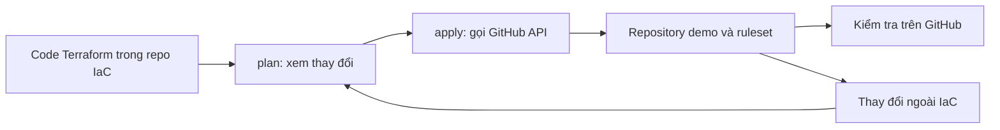
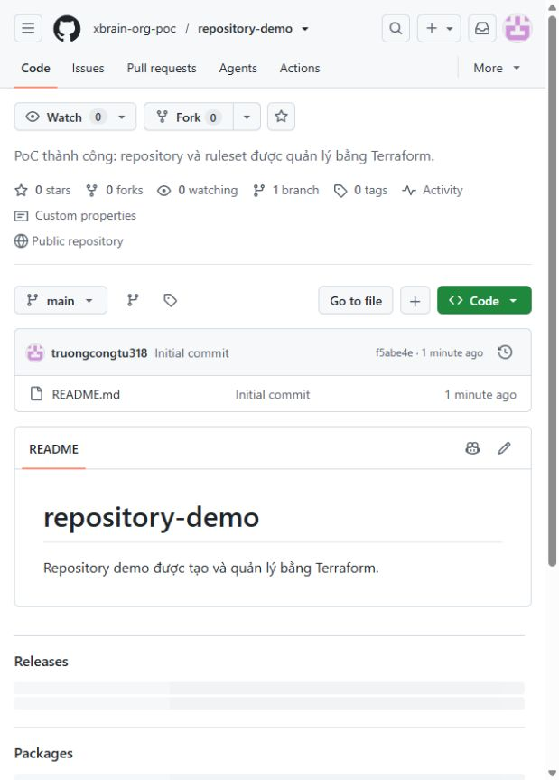
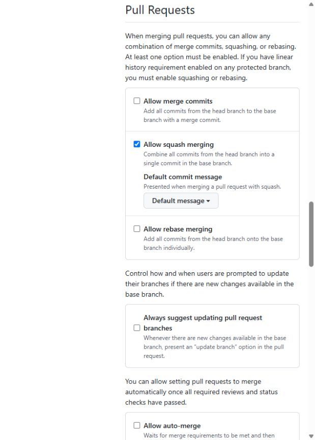
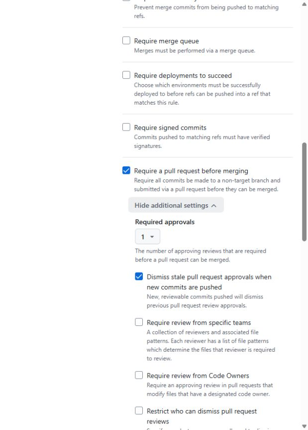

# PoC quản lý GitHub Repository bằng Terraform

**Ngày thực hiện:** 30/09/2026 · **Organization:** [xbrain-org-poc](https://github.com/xbrain-org-poc) · **Gói:** GitHub Free

PoC chứng minh Terraform có thể tạo và quản lý repository trong GitHub Organization: cấu hình tính năng và cách merge, cập nhật bằng code, phát hiện và khôi phục drift, áp dụng ruleset rồi kiểm tra quy tắc qua PR thật.

## Mô hình

| Repository | Vai trò |
| --- | --- |
| [iac-repository-management-poc](https://github.com/xbrain-org-poc/iac-repository-management-poc) | Chứa mã Terraform, README và evidence. Terraform cũng quản lý cấu hình của repo này. |
| [repository-demo](https://github.com/xbrain-org-poc/repository-demo) | Repo public được Terraform tạo để kiểm chứng luồng và ruleset. |

Organization được tạo thủ công. Terraform gọi GitHub API từ máy chạy lệnh. Repo demo và ruleset nằm trong [`demo.tf`](demo.tf); mã và evidence được lưu ở repo IaC.



## Cần chứng minh gì, đã làm được gì?

| Nội dung | Kết quả thực tế | Evidence |
| --- | --- | --- |
| Tạo repo và ruleset bằng Terraform | `2 added, 0 changed, 0 destroyed`; repo xuất hiện trong đúng org | [Plan](docs/evidence/demo/02-create-plan.txt), [apply](docs/evidence/demo/03-create-apply.txt), ảnh 1 |
| Thiết lập repo bằng IaC | Public, Issues bật, Wiki/Projects tắt, chỉ squash merge, xóa nhánh sau merge | [GitHub API](docs/evidence/demo/15-final-settings.json), ảnh 4–5 |
| Cập nhật bằng IaC | Sửa mô tả trong code; plan/apply chỉ cập nhật repo demo, không tạo lại | [Plan](docs/evidence/demo/07-update-plan.txt), [apply](docs/evidence/demo/08-update-apply.txt), ảnh 2 |
| Phát hiện drift | Tắt Issues ngoài Terraform; plan thấy `has_issues = false -> true` | [Trạng thái lệch](docs/evidence/demo/10-drift-before.json), [plan](docs/evidence/demo/11-drift-plan.txt), ảnh 3 |
| Khôi phục drift | Apply bật lại Issues; plan cuối báo `No changes` | [Apply](docs/evidence/demo/13-drift-apply.txt), [plan sau merge](docs/evidence/demo/27-post-merge-plan.txt), ảnh 4 |
| Ruleset trên `main` | Active, yêu cầu PR và 1 approval, chỉ squash; bypass list rỗng | [Rule từ GitHub API](docs/evidence/demo/05-main-rules.json), ảnh 6–7 |
| Chặn ghi thẳng vào `main` | GitHub trả HTTP 409: `Changes must be made through a pull request` | [Phản hồi GitHub](docs/evidence/demo/17-direct-main-rejected.txt) |
| Chặn merge khi thiếu review | [PR demo #1](https://github.com/xbrain-org-poc/repository-demo/pull/1) báo `Review required`, `Merging is blocked`; nút merge bị vô hiệu hóa | [Trạng thái PR trước review](docs/evidence/demo/16-pr-review-status.json), ảnh 8 |
| Approve và merge | `hofang42` approve, squash merge PR vào `main`; nhánh demo được xóa | [PR đã merge](docs/evidence/demo/23-pr-merged.json), [danh sách nhánh](docs/evidence/demo/24-branches-after-merge.txt), ảnh 9 |

## Ảnh bằng chứng

Ảnh được chụp từ GitHub trong quá trình thực hiện. Mỗi ảnh dưới đây chứng minh đúng phần ghi trong chú thích; log plan/apply là bằng chứng cho thao tác Terraform.

### 1. Repo demo được tạo trong org

Repo public đã xuất hiện trong `xbrain-org-poc`; [log apply](docs/evidence/demo/03-create-apply.txt) xác nhận Terraform tạo repo và ruleset.


### 2. Mô tả repo đổi sau khi apply

Mô tả trên GitHub đổi thành “PoC thành công: repository và ruleset được quản lý bằng Terraform.”



### 3. Tạo drift: Issues bị tắt ngoài IaC

Cấu hình Terraform vẫn ghi `has_issues = true`. Khi Issues bị tắt qua GitHub API, plan nhận ra chênh lệch.


### 4. Khôi phục drift: Issues bật lại

Apply đưa GitHub về đúng khai báo; [plan sau merge](docs/evidence/demo/27-post-merge-plan.txt) báo `No changes` cho cả repo IaC và repo demo.


### 5. Cách merge của repo demo

GitHub chỉ bật squash merge; merge commit và rebase merge đều tắt.



### 6. Ruleset đang active

Ruleset `protect-default-branch` áp dụng cho `main`, không có bypass actor.


### 7. Điều kiện PR và review

Ruleset yêu cầu PR và một approving review; cấu hình cũng bật hủy approval cũ khi có commit mới. Việc hủy approval cũ **chưa được thử bằng PR riêng**.



### 8. PR bị chặn trước approval

[PR #1](https://github.com/xbrain-org-poc/repository-demo/pull/1) hiển thị `Review required` và `Merging is blocked` khi chưa có review hợp lệ.


### 9. PR được approve, merge và xóa nhánh

Reviewer `hofang42` approve, sau đó merge một commit vào `main`. GitHub ghi nhận nhánh `demo/verify-review-rule` được xóa; [API chỉ còn nhánh `main`](docs/evidence/demo/24-branches-after-merge.txt).


## Mã nguồn và tái hiện

```text
.
├── README.md
├── main.tf             # Repo IaC và ruleset của nó
├── demo.tf             # Repo demo và ruleset của repo demo
├── variables.tf
├── outputs.tf
├── .terraform.lock.hcl
├── .gitignore
└── docs/
    ├── huong-dan-chay.md
    └── evidence/
        ├── demo/       # Ảnh, plan/apply log và phản hồi GitHub
        └── bootstrap/  # Ảnh/log giai đoạn tạo repo IaC ban đầu
```

Xem [hướng dẫn chạy và import state](docs/huong-dan-chay.md). Terraform state và binary plan được lưu local, loại khỏi Git. Người clone mới cần import resource đã tồn tại trước khi apply. PoC này chạy apply thủ công bằng một state local.

## Giới hạn đã ghi nhận

- Chưa kiểm chứng bằng PR việc approval cũ bị hủy sau khi push commit mới. Ruleset có khai báo và GitHub API trả về `dismiss_stale_reviews_on_push = true`.
- Ruleset của PoC nằm ở cấp từng repo public. Theo [GitHub Docs](https://docs.github.com/en/repositories/configuring-branches-and-merges-in-your-repository/managing-rulesets), GitHub Free hỗ trợ ruleset trên repo public; repo private trong org cần gói Team trở lên. [Ruleset cấp organization](https://docs.github.com/en/organizations/managing-organization-settings/creating-rulesets-for-repositories-in-your-organization) cũng cần Team/Enterprise.
- Remote state và pipeline plan/apply tự động chưa triển khai trong PoC; không phải giới hạn của gói Free.

**Kết quả:** luồng tạo → cập nhật → phát hiện drift → khôi phục → plan không đổi đã chạy. Ruleset đã chặn ghi trực tiếp và chặn merge khi thiếu approval; PR đã được reviewer khác tác giả approve, squash merge vào `main` và nhánh demo đã được xóa.
